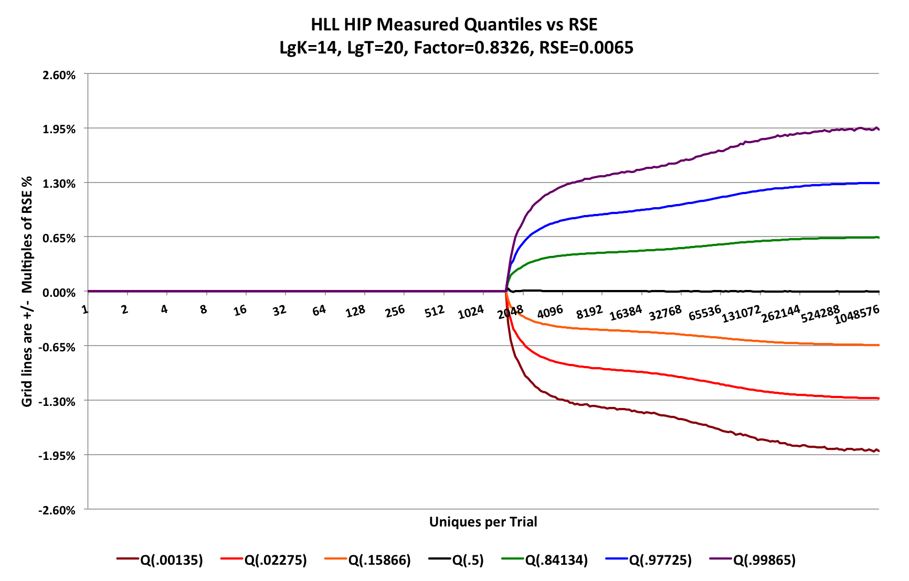

<!--
    Licensed to the Apache Software Foundation (ASF) under one
    or more contributor license agreements.  See the NOTICE file
    distributed with this work for additional information
    regarding copyright ownership.  The ASF licenses this file
    to you under the Apache License, Version 2.0 (the
    "License"); you may not use this file except in compliance
    with the License.  You may obtain a copy of the License at

      http://www.apache.org/licenses/LICENSE-2.0

    Unless required by applicable law or agreed to in writing,
    software distributed under the License is distributed on an
    "AS IS" BASIS, WITHOUT WARRANTIES OR CONDITIONS OF ANY
    KIND, either express or implied.  See the License for the
    specific language governing permissions and limitations
    under the License.
-->

# Unique Counting Sketch Accuracy Characterization

### Goal
The goal is to produce an accuracy plot like this:



### Generating the X-axis Plot Points Series

The x-axis is logarithmic in base 2 and defines the accuracy characterization range of *n* for the sketch. The range of the above plot consists of 20 powers of 2 or 20 octaves.  For good plot visualization, we want the actual plotted points to be evenly spaced and close enough so that there are no visual jagged edges in the curves, but no closer.  

For this plot I chose Plot Points per Octave (PPO) of 16.  We generate an exponential series of integers corresponding to the desired plot points.  In theory, this would produce 320 (20 x 16) plot points. However, there are obviously not 16 integers between the low powers of 2 on the left so I created a simple function to generate the power series that adjusts for this:

```java
import static java.lang.Math.*;

import org.testng.annotations.Test;

public class CreatePowerSeries {

  static double log2(double x) { return log(x)/log(2); }

  public static long pwr2SeriesNext(final int ppo, final long curPoint) {
    final long cur = curPoint < 1L ? 1L : curPoint;
    int gi = (int)round(log2(cur) * ppo); //current generating index
    long next;
    do {
      next = Math.round(pow(2.0, (double) ++gi / ppo));
    } while ( next <= curPoint);
    return next;
  }

  static long maxPt = 1L << 10; //for the power series 1 ... 1024
  static long minPt = 1L;
  static int ppo = 4;  //adjust as needed
  
  @Test
  public void printSeries() {
    for (long p = minPt; p <= maxPt; p = pwr2SeriesNext(ppo, p)) {
      System.out.print(p + " ");
    }
    System.out.println();
  }
}
```

To keep the output small for this document I set $maxPt = 2^{10}$ and $ppo = 4$.  The result series is <br>1 2 3 4 5 6 7 8 10 11 13 16 19 23 27 32 38 45 54 64 76 91 108 128 152 181 215 256 304 362 431 512 609 724 861 1024 

### The HLL sketch
The HLL sketch was configured with $lgK = 14$

### The Y-axis 

The Y-axis of the above plot has the grid intervals at multiples of the inherent Relative Standard Error (RSE) of the sketch, computed as $RSE=.8326/sqrt(2^{lgK})= 0.0065$.  Therefore the grid lines above and below the X-axis represent +/- # of standard deviations. As you can see in the plot the sketch accuracy is asymtotic to +/- 2 standard deviations from the mean or +/- 1.3% with 95.4% confidence. Or, equivalently, +/- 3 standard deviations from the mean or +/- 1.95% with a 99.73% confidence.

### Configuring each Plot Point (PP)

At each Plot Point I configure a high accuracy Quantile Sketch with a $lgK=12$. Each point also has an associated value, $v$ from the Plot Point Series indicating its true value.  Each PP also records cumulative statistics for each estimate value computed for that PP.

Let q[i] be the index of a PP in the PP array.  
Let q[i].v be the true-value of that plot point.

### Running a single trial
A single trial consists of these steps:

1. Configure a new sketch
2. At the first PP update the sketch with $q[i].v$ values.  Get the estimate from the sketch and feed it to the quantile sketch. With each update the cumulative statistics values are computed.
3. At each subsquent PP, update the sketch with $delta = q[i].v - q[i-1].v$ values. Get the estimate from the sketch and feed it to the quantile sketch. Update the cumulative statistics.
4. Reset the sketch for the next trial

#### Running multiple trials
The number of trials can be in the millions, It is important to understand that scanning across the plot-points and incrementing the sketches with deltas is critical for performing the characterization test in minimum time.  If $T$ is the number of trials and $n=2^{20}$, the number of updates to the sketch is $Tn$. If $T=1M$ and $n=1M$ the number of sketch updates is ~1B.

If, however, you create a new sketch at each PP and update the sketch with $q[i].v$ at each PP, you would end up with $T(n^{2} + n)$ sketch updates. Running a test with a million trials and $n=1M$, would be ~1T updates!

At the end of running all the trials the quantile statistics are collected from all the quantile sketches and the plots are generated.

The major code for this test can be found in these files:

* [HllAccuracyProfile.java](https://github.com/apache/datasketches-characterization/blob/master/java-base/src/main/java/org/apache/datasketches/characterization/hll/HllAccuracyProfile.java)

* [BaseAccuracyProfile.java](https://github.com/apache/datasketches-characterization/blob/master/java-base/src/main/java/org/apache/datasketches/characterization/uniquecount/BaseAccuracyProfile.java)

* [AccuracyStats](https://github.com/apache/datasketches-characterization/blob/master/java-base/src/main/java/org/apache/datasketches/characterization/AccuracyStats.java)

* [HllAccuracyJob.conf](https://github.com/apache/datasketches-characterization/blob/master/java-base/src/main/resources/hll/HllAccuracyJob.conf)


Lee Rhodes  
9 Jul 2026


